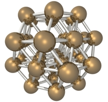

Lennard Jones Cluster
======================================================

.. versionadded:: 2.11

*#include <pagmo/problems/lennard_jones.hpp>*

   A cluster of atoms.

.. cpp:namespace-push:: pagmo

.. cpp:class:: lennard_jones

   This is a box-constrained continuous single-objecive problem. It represents the minimization
   of the energy of a cluster of atoms assuming a Lennard-Jones potential between each pair.
   The complexity for computing the objective function scales with the square of the number of atoms.
  
   The decision vector contains :math:`[z_2, y_3, z_3, x_4, y_4, z_4, ....]` as the cartesian coordinates
   :math:`x_1, y_1, z_1, x_2, y_2` and :math:`x_3` are fixed to be zero.
  
   See: http://doye.chem.ox.ac.uk/jon/structures/LJ.html
  
   .. cpp:function:: lennard_jones(unsigned atoms = 3u)

      Constructs a UDP representing the Lennard Jones Clusters global optimisation problem.

      :param atoms: the number of atoms in the cluster.
      :exception std\:\:invalid_argument: if *atoms* is < 3

   .. cpp:function:: vector_double fitness(const vector_double &x) const

      Computes the fitness for this UDP. The complexity is :math:`n^2`, where :math:`n^2` is the number of atoms.
    
      :param x: the decision vector.
      :return: the fitness of *x*.

   .. cpp:function:: std::pair<vector_double, vector_double> get_bounds() const

      Returns the box-bounds for this UDP.
     
      :return: the lower and upper bounds for each of the decision vector components.

   .. cpp:function:: std::string get_name() const

      Returns the problem name.

      :return: a string containing the problem name: "Lennard Jones Cluster (*atoms* atoms)".

   .. cpp:function:: template <typename Archive> void serialize(Archive &ar, unsigned)

      Object serialization.

      This method will save/load this into the archive *ar*.

      :param ar: target archive.
      :exception unspecified: any exception thrown by the serialization of the UDP and of primitive types.

