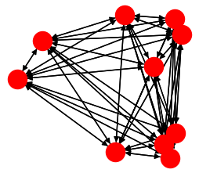

Fully connected
===============

.. versionadded:: 2.11

*#include <pagmo/topologies/fully_connected.hpp>*

.. cpp:namespace-push:: pagmo

.. cpp:class:: fully_connected

   This user-defined topology (UDT) represents a *complete graph* (that is, a topology in which
   all vertices connect to all other vertices). The edge weight is configurable at construction,
   and it will be the same for all the edges in the topology.

   .. cpp:function:: fully_connected()

      Default constructor.

      Equivalent to the constructor from edge weight with *w* = 1.

   .. cpp:function:: explicit fully_connected(double w)

      Constructor from edge weight.

      Equivalent to the constructor from number of vertices *n* = 0 and edge
      weight *w*.

      :param w: the weight of the edges.

      :except std\:\:invalid_argument: if *w* is not in the :math:`\left[0, 1\right]` range.

   .. cpp:function:: explicit fully_connected(std::size_t n, double w)

      Constructor from number of vertices and edge weight.

      This constructor will initialise a :cpp:class:`~pagmo::fully_connected` topology
      with *n* vertices and whose edges will all have a weight of *w*.

      :param n: the desired number of vertices.
      :param w: the weight of the edges.

      :except std\:\:invalid_argument: if *w* is not in the :math:`\left[0, 1\right]` range.

   .. cpp:function:: fully_connected(const fully_connected &)
   .. cpp:function:: fully_connected(fully_connected &&) noexcept

      :cpp:class:`~pagmo::fully_connected` is copy and move constructible.

   .. cpp:function:: void push_back()

      Add a new vertex.

   .. cpp:function:: std::pair<std::vector<std::size_t>, vector_double> get_connections(std::size_t i) const

      Get the list of connections to the *i*-th vertex.

      :param i: the index of the vertex whose connections will be returned.

      :return: the list of vertices connecting to the *i*-th vertex (that is, all vertices apart from *i*
         itself) and the corresponding edge weights.

      :exception std\:\:invalid_argument: if *i* is not smaller than the current size of the topology.

   .. cpp:function:: std::string get_name() const

      :return: ``"Fully connected"``.

   .. cpp:function:: std::string get_extra_info() const

      :return: a human-readable string containing additional info about this topology.

   .. cpp:function:: double get_weight() const

      :return: the weight *w* used when constructing this topology.

   .. cpp:function:: std::size_t num_vertices() const

      :return: the number of vertices in the topology.

   .. cpp:function:: template <typename Archive> void save(Archive &ar, unsigned) const
   .. cpp:function:: template <typename Archive> void load(Archive &ar, unsigned)

      These functions implement the (de)serialisation of a :cpp:class:`~pagmo::fully_connected` topology.

      :param ar: the input/output archive.

      :exception unspecified: any exception thrown by the (de)serialisation of primitive types.

.. cpp:namespace-pop::
