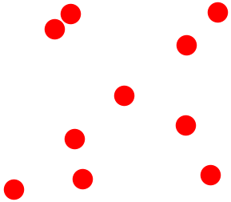

Unconnected topology
====================

.. versionadded:: 2.11

*#include <pagmo/topologies/unconnected.hpp>*

.. cpp:namespace-push:: pagmo

.. cpp:class:: unconnected

   This user-defined topology (UDT) represents an unconnected graph.

   .. cpp:function:: std::pair<std::vector<std::size_t>, vector_double> get_connections(std::size_t) const

      Get the list of connections.

      In an unconnected topology there are no connections for any vertex.

      :return: a pair of empty vectors.

   .. cpp:function:: void push_back()

      Add the next vertex.

      This method is a no-op.

   .. cpp:function:: std::string get_name() const

      Get the name of the topology.

      :return: ``"Unconnected"``.

   .. cpp:function:: template <typename Archive> void serialize(Archive &, unsigned)

      Serialisation support.

      This class is stateless, no data will be loaded or saved during serialization.

.. cpp:namespace-pop::
