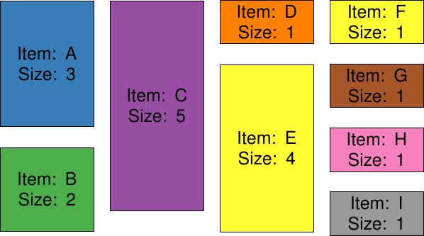
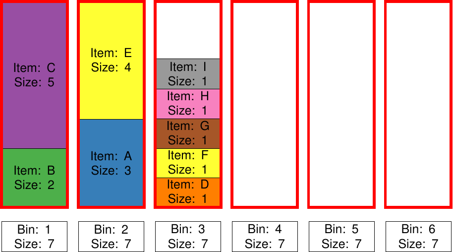

.. _cpp_tut_bin_packing:

Bin Packing
===========

In the original bin packing problem (*bpp*) one has to *pack* items of different volume/size into a finite number of containers or bins.
The aim is to minimze the number of containers that have to be used.  This is a NP-hard problem. 

Since then bin packing has been extended in many different ways: 2D bin packing, 3D bin packing, packing by weight or cost etc.
Problems similar to bin packing or application of bpp can be found in many different domains (computer science, logistic, job shop scheduling etc.).
Thus, it is still a very relevant problem with several new solvers being applied/tested/introduced every year 
(Feng et al. "*An Enhanced Grasshopper Optimization Algorithm to the Bin Packing Problem*"; 
Abdel-Basset et al. "*An improved nature inspired meta-heuristic algorithm for 1-D bin packing problem*").

Here we consider a 1D version of bin packing, where we have a set of objects that need to be packed into a set of bins. 
All bins have the same size and the aim is to minimize the number of bins used. The different items can be of different size.
An example of items are shown in the figure below. The total size of all items is 18.5.

These items have to fit into into six containers. Each container is of size 7, i.e. there is enough space for all items. 
A solution minimizing the number of used bins could look like this:

Other solutions using the same number of bins is also possible.
For a small example the solution is trivial and can easily be made by hand. 
Lets see how we can solve this problem using pagmo, so that we can also solve non-trivial versions of this problem.
 
Problem Definition
------------------

For the bin packing problem we need to know 4 things.

- How many bins are there?
- How large are the bins?
- How many items are there?
- How large are the items?

The bounds and constraints are fairly straightforwards. All items have to be packed into one of the bins, i.e. between 0 and *max_bin_num - 1*.
The sum of the items in a bin cannot be larger than the size of the bins.  

Just like in the :ref:`First Problem<cpp_tut_first_problem>` we have to implement 4 functions: 

- ``fitness()``
- ``get_bounds()``
- ``get_nic()``
- ``get_nix()``

Lets start with the fitness function. As an input it receives a vector of possible item mappings, i.e. a possible solution.
For this solution it then computes the fitness, which in this case is the number of bins used. 
The computed fitness value is then stored in a return vector. 

After the fitness value we need to compute if the constraints are met, i.e. is there enough space left in the bins. 
For this we loop over all bins and all items and compute the usage of each bin. For each bin we add an entry to the 
return vector which represents the inequality. Each inequality number has to be smaller or equal to 0. 

.. code-block:: c++

    // Implementation of the objective function and all constraints
    pagmo::vector_double fitness(const pagmo::vector_double &x_i) const {
        // variables
        double num_bins_used = 0; //how many bins are used
        std::vector<int> bin_used(num_bins, 0);

        // where x_i is the bin in which an item i is placed
        // determine if a bin is used based on x_i
        for (int i = 0; i < num_items; ++i) {
            for (int j = 0; j < num_bins; ++j) {
                if (x_i[i] == j){
                    bin_used[j] = 1;
                }
            }
        }

        // Objective function calculation; i.e. how many bins are used? We want to minimize this!
        for(auto& y: bin_used){
            num_bins_used += y;
        }

        // Make return vector and adding objective
        pagmo::vector_double return_vector{num_bins_used};

        // Adding inequalities to stick to the maximum size of the bin
        for (int j = 0; j < num_bins; ++j) {
            int temp_bin_occupation = 0;
            for (int i = 0; i < num_items; ++i) {
                if (x_i[i] == j){
                    temp_bin_occupation += items[i] ; // <= 0
                }
            }
            return_vector.emplace_back(temp_bin_occupation - size_bins);
        }
        return return_vector;
    }
    
Besides the fitness and the constraints we need to make sure that the bounds are also correct. We do not want that the 
genetic algorithm starts packing items into a non existent bins. Therefore, the ``get_bounds()`` function returns the 
lower and upper bound for each item. In our case the lower bound is 0 (i.e. Bin 1) and the upper bound is number of bins - 1.

.. code-block:: c++

    // The lower and upper bounds are the bins in which an item can be placed.
    std::pair<pagmo::vector_double, pagmo::vector_double> get_bounds() const {
        std::vector<double> lower(num_items, 0);
        std::vector<double> upper(num_items, num_bins-1);
        return {lower, upper};
    }

The ``get_nix()`` function returns the integer dimension of the problem, i.e. the size of the solution. In this case its given by the number of items.

.. code-block:: c++

    // Integer dimension of the problem - i.e. into which bin each item is packed
    pagmo::vector_double::size_type get_nix() const {
        return pagmo::vector_double::size_type(num_items);
    }
    
Lastly, we need the number of inequalities, which is equal to the number of bins, as we need one inequality per bin. 
    
.. code-block:: c++
    
    // Number of inequality constraints.
    pagmo::vector_double::size_type get_nic() const {
        return pagmo::vector_double::size_type(num_bins);
    }

We can again solve this problem with :ref:gaco or :ref:ihs. 
Combining the problem definition plus soliving it with gaco or ihs results in the following code. 

.. literalinclude:: ../../../../../tutorials/problem_bin_packing.cpp
   :caption: problem_bin_packing.cpp
   :language: c++
   :linenos:
   
Solving the problem with either ihs or gaco will result in a solution that occupies 3 bins, i.e. finding an optimal solution. 

