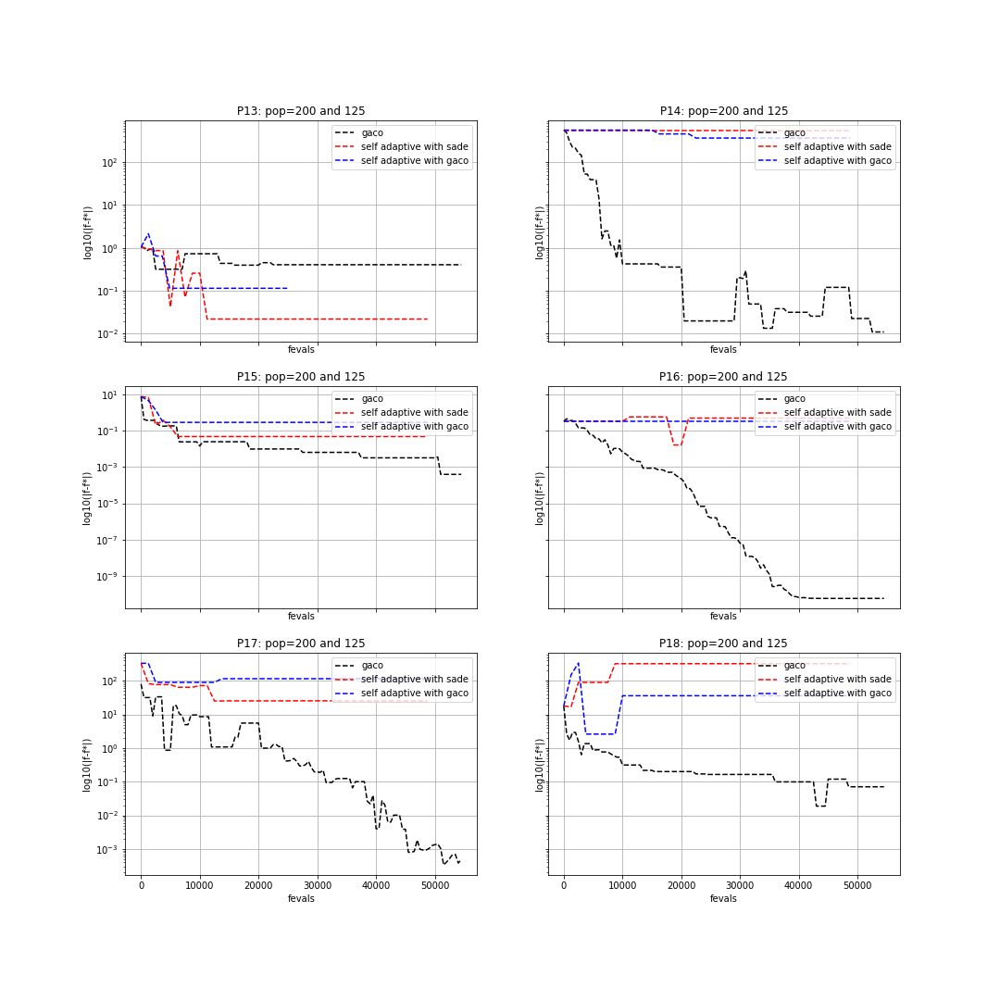

.. _py_tutorial_cec2006_gaco_benchmark_comp:

Benchmarking Extended Ant Colony Optimization on CEC2006 problems
=================================================================

In this tutorial we will show how to use pygmo to run :class:`~pygmo.gaco` algorithm and benchmark it with the test problem suite used in the
Special Session on Constrained Real-Parameter Optimization, CEC-06, Vancouver, Canada, 17-21 July.

All of the CEC 2006 problems are box-bounded, continuous, single objective constrained problems and are provided as UDP 
(user-defined problems) by pygmo in the class :class:`~pygmo.cec2006`. 
We now want to benchmark three user-defined algorithms. Since this is a constrained probelm, we need a UDA (user-defined
algorithm) which can handle constraints. In this respect, we can make use of the pygmo meta-algorithm :class:`~pygmo.cstrs_self_adaptive`
to allow the use of any UDA for constrained problems. Hence, we will benchmark the extended ant colony optimization algorithm :class:`~pygmo.gaco`, 
with this same algorithm and with the self-adaptive differential evolution algorithm :class:`~pygmo.sade`, both coupled with a self-adaptive constraints handling technique. 

In particular, we will make use of the three aforesaid UDAs on 6 of the 24 CEC2006 problems (namely, problems: 13, 14, 15,
16, 17, 18). The best known fitness for these problems can be found in the technical report: "Problem Definitions and Evaluation Criteria for the CEC 2006 Special Session on Constrained 
Real-Parameter Optimization", by J. J. Liang, et al., 2006.
In order to run the UDAs on these problems we can write the following piece of code:

.. doctest::
 
    >>> import pygmo as pg
    >>> #we first save the best known solutions in a vector:
    >>> real_minima=[0.0539415140, -47.7648884595, 961.7150222899, -1.9051552586, 8853.5396748064, -0.8660254038]
    >>> #we instantiate the problems
    >>> problems=[pg.cec2006(13), pg.cec2006(14), pg.cec2006(15), pg.cec2006(16), pg.cec2006(17), pg.cec2006(18)]
    >>> for index in range(0,6):
    ...       #we extract the problem of the case:
    ...       udp = problems[index]
    ...       prob = pg.problem(udp)
    ...       #Instantiate pagmo algorithms:
    ...       uda_gaco = pg.gaco(550, 100, 1.0, real_minima[index], 0.0, 200, 7, 10000, 10000, 0.0, False, 23)
    ...       uda_cstrs_sade=pg.cstrs_self_adaptive(40,pg.sade(10, 2, 1, 1e-6, 1e-6, False, 23))
    ...       uda_cstrs_gaco=pg.cstrs_self_adaptive(40,pg.gaco(10, 125, 1.0, real_minima[index], 0.0, 8, 7, 10000, 10000, 0.0, False, 23))
    ...       algo_gaco=pg.algorithm(uda_gaco)
    ...       algo_cstrs_sade=pg.algorithm(uda_cstrs_sade)
    ...       algo_cstrs_gaco=pg.algorithm(uda_cstrs_gaco)
    ...       #Set the seed for reproducibility purposes:
    ...       algo_gaco.set_seed(23)
    ...       algo_cstrs_sade.set_seed(23)
    ...       algo_cstrs_gaco.set_seed(23)
    ...       #Instantiate populations:
    ...       pop_gaco = pg.population(prob, size=100, seed=23)
    ...       pop_cstrs_sade = pg.population(prob, size=125, seed=23)
    ...       pop_cstrs_gaco = pg.population(prob, size=125, seed=23)
    ...       #Set verbosity:
    ...       algo_gaco.set_verbosity(5)
    ...       algo_cstrs_sade.set_verbosity(1)
    ...       algo_cstrs_gaco.set_verbosity(1)
    ...       #Run the evolution:
    ...       pop_gaco=algo_gaco.evolve(pop_gaco)
    ...       pop_cstrs_sade=algo_cstrs_sade.evolve(pop_cstrs_sade)
    ...       pop_cstrs_gaco=algo_cstrs_gaco.evolve(pop_cstrs_gaco)
    ...       #Extract the log:
    ...       uda_gaco=algo_gaco.extract(pg.gaco)
    ...       uda_sa_sade=algo_cstrs_sade.extract(pg.cstrs_self_adaptive)
    ...       uda_sa_gaco=algo_cstrs_gaco.extract(pg.cstrs_self_adaptive)
    ...       #The logs are saved for each problem:
    ...       if (index==0):
    ...           log_gaco_P13=uda_gaco.get_log()
    ...           log_sa_sade_P13=uda_sa_sade.get_log()
    ...           log_sa_gaco_P13=uda_sa_gaco.get_log()
    ...       elif (index==1):
    ...           log_gaco_P14=uda_gaco.get_log()
    ...           log_sa_sade_P14=uda_sa_sade.get_log()
    ...           log_sa_gaco_P14=uda_sa_gaco.get_log()
    ...       elif (index==2):
    ...           log_gaco_P15=uda_gaco.get_log()
    ...           log_sa_sade_P15=uda_sa_sade.get_log()
    ...           log_sa_gaco_P15=uda_sa_gaco.get_log()
    ...       elif (index==3):
    ...           log_gaco_P16=uda_gaco.get_log()
    ...           log_sa_sade_P16=uda_sa_sade.get_log()
    ...           log_sa_gaco_P16=uda_sa_gaco.get_log()
    ...       elif (index==4):
    ...           log_gaco_P17=uda_gaco.get_log()
    ...           log_sa_sade_P17=uda_sa_sade.get_log()
    ...           log_sa_gaco_P17=uda_sa_gaco.get_log()
    ...       elif (index==5):
    ...           log_gaco_P18=uda_gaco.get_log()
    ...           log_sa_sade_P18=uda_sa_sade.get_log()
    ...           log_sa_gaco_P18=uda_sa_gaco.get_log()

In this case, we run :class:`~pygmo.gaco` using a population of 100 individuals and 550 generations, whereas we run
:class:`~pygmo.gaco` and :class:`~pygmo.sade` with :class:`~pygmo.cstrs_self_adaptive` for 40 iterations with 10 generations
and 125 individuals in the population.
We can now plot the results in a semilog graph with the absolute value of the  best fitness minus the 
known best fitness in the y-axis and the function evaluations in the x-axis. For doing this, we write the following piece of code:

.. doctest::
    
    >>> import matplotlib as mlp #doctest: +SKIP
    >>> import matplotlib.pyplot as plt #doctest: +SKIP
    >>> fig, axes = plt.subplots(nrows=3, ncols=2, sharex='col', sharey='row', figsize=(15,15)) #doctest: +SKIP
    <BLANKLINE>
    >>> axes[0,0].semilogy([entry[1] for entry in log_gaco_P13], [abs(entry[2]-real_minima[0]) for entry in log_gaco_P13],'k--', label = 'gaco') #doctest: +SKIP
    >>> axes[0,0].semilogy([entry[1] for entry in log_sa_sade_P13], [abs(entry[2]-real_minima[0]) for entry in log_sa_sade_P13],'r--', label = 'self adaptive with sade') #doctest: +SKIP
    >>> axes[0,0].semilogy([entry[1] for entry in log_sa_gaco_P13], [abs(entry[2]-real_minima[0]) for entry in log_sa_gaco_P13], 'b--', label = 'self adaptive with gaco') #doctest: +SKIP
    >>> axes[0,0].legend(loc='upper right') #doctest: +SKIP
    >>> axes[0,0].set_title('P13: pop=200 and 125') #doctest: +SKIP
    <BLANKLINE> 
    >>> axes[0,1].semilogy([entry[1] for entry in log_gaco_P14], [abs(entry[2]-real_minima[1]) for entry in log_gaco_P14],'k--', label = 'gaco') #doctest: +SKIP
    >>> axes[0,1].semilogy([entry[1] for entry in log_sa_sade_P14], [abs(entry[2]-real_minima[1]) for entry in log_sa_sade_P14],'r--', label = 'self adaptive with sade') #doctest: +SKIP
    >>> axes[0,1].semilogy([entry[1] for entry in log_sa_gaco_P14], [abs(entry[2]-real_minima[1]) for entry in log_sa_gaco_P14], 'b--', label = 'self adaptive with gaco') #doctest: +SKIP
    >>> axes[0,1].legend(loc='upper right') #doctest: +SKIP
    >>> axes[0,1].set_title('P14: pop=200 and 125') #doctest: +SKIP
    <BLANKLINE> 
    >>> axes[1,0].semilogy([entry[1] for entry in log_gaco_P15], [abs(entry[2]-real_minima[2]) for entry in log_gaco_P15],'k--', label = 'gaco') #doctest: +SKIP
    >>> axes[1,0].semilogy([entry[1] for entry in log_sa_sade_P15], [abs(entry[2]-real_minima[2]) for entry in log_sa_sade_P15],'r--', label = 'self adaptive with sade') #doctest: +SKIP
    >>> axes[1,0].semilogy([entry[1] for entry in log_sa_gaco_P15], [abs(entry[2]-real_minima[2]) for entry in log_sa_gaco_P15], 'b--', label = 'self adaptive with gaco') #doctest: +SKIP
    >>> axes[1,0].legend(loc='upper right') #doctest: +SKIP
    >>> axes[1,0].set_title('P15: pop=200 and 125') #doctest: +SKIP
    <BLANKLINE>
    >>> axes[1,1].semilogy([entry[1] for entry in log_gaco_P16], [abs(entry[2]-real_minima[3]) for entry in log_gaco_P16],'k--', label = 'gaco') #doctest: +SKIP
    >>> axes[1,1].semilogy([entry[1] for entry in log_sa_sade_P16], [abs(entry[2]-real_minima[3]) for entry in log_sa_sade_P16],'r--', label = 'self adaptive with sade') #doctest: +SKIP
    >>> axes[1,1].semilogy([entry[1] for entry in log_sa_gaco_P16], [abs(entry[2]-real_minima[3]) for entry in log_sa_gaco_P16], 'b--', label = 'self adaptive with gaco') #doctest: +SKIP
    >>> axes[1,1].legend(loc='upper right') #doctest: +SKIP
    >>> axes[1,1].set_title('P16: pop=200 and 125') #doctest: +SKIP
    <BLANKLINE>
    >>> axes[2,0].semilogy([entry[1] for entry in log_gaco_P17], [abs(entry[2]-real_minima[4]) for entry in log_gaco_P17],'k--', label = 'gaco') #doctest: +SKIP
    >>> axes[2,0].semilogy([entry[1] for entry in log_sa_sade_P17], [abs(entry[2]-real_minima[4]) for entry in log_sa_sade_P17],'r--', label = 'self adaptive with sade') #doctest: +SKIP
    >>> axes[2,0].semilogy([entry[1] for entry in log_sa_gaco_P17], [abs(entry[2]-real_minima[4]) for entry in log_sa_gaco_P17], 'b--', label = 'self adaptive with gaco') #doctest: +SKIP
    >>> axes[2,0].legend(loc='upper right') #doctest: +SKIP
    >>> axes[2,0].set_title('P17: pop=200 and 125') #doctest: +SKIP
    <BLANKLINE>
    >>> axes[2,1].semilogy([entry[1] for entry in log_gaco_P18], [abs(entry[2]-real_minima[5]) for entry in log_gaco_P18],'k--', label = 'gaco') #doctest: +SKIP
    >>> axes[2,1].semilogy([entry[1] for entry in log_sa_sade_P18], [abs(entry[2]-real_minima[5]) for entry in log_sa_sade_P18],'r--', label = 'self adaptive with sade') #doctest: +SKIP
    >>> axes[2,1].semilogy([entry[1] for entry in log_sa_gaco_P18], [abs(entry[2]-real_minima[5]) for entry in log_sa_gaco_P18], 'b--', label = 'self adaptive with gaco') #doctest: +SKIP
    >>> axes[2,1].legend(loc='upper right') #doctest: +SKIP
    >>> axes[2,1].set_title('P18: pop=200 and 125') #doctest: +SKIP
    <BLANKLINE>
    >>> for ax in axes.flat: #doctest: +SKIP
    ...       ax.set(xlabel='fevals', ylabel='log10(|f-f*|)') #doctest: +SKIP
    ...       ax.grid() #doctest: +SKIP

The resulting plot can be seen in the following figure:

