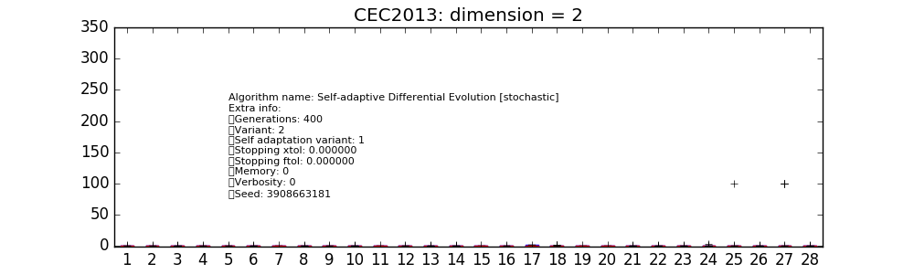
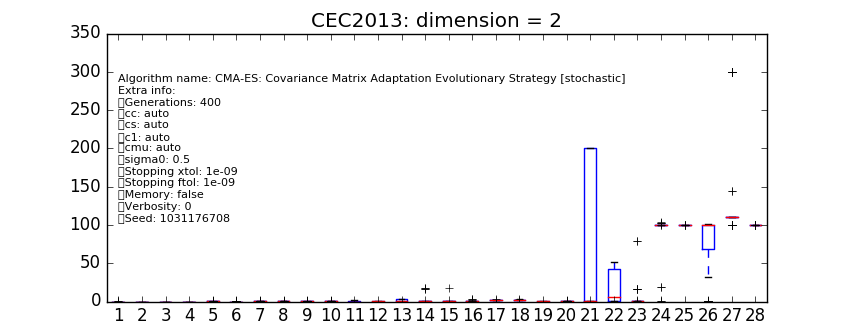
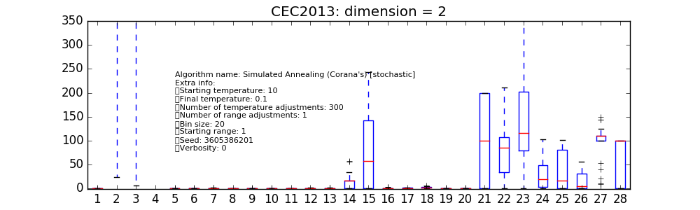
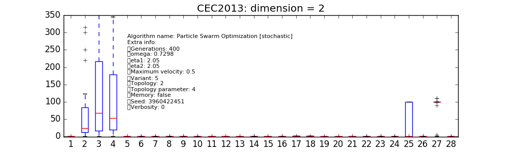
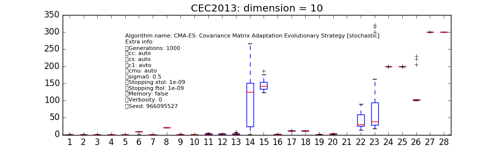
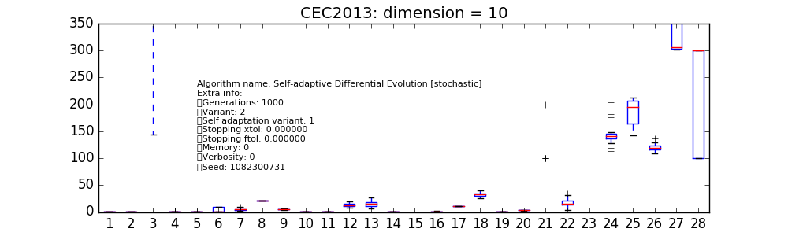

.. _py_tutorial_cec2013_comp:

Participating to the CEC2013 Competition
===============================================

In this tutorial we will show how to use pygmo to run algorithms on the test problem suite used in the
Special Session & Competition on Real-Parameter Single Objective Optimization at CEC-2013, Cancun, Mexico 21-23 June 2013.

All of the CEC 2013 problems are box-bounded, continuous, single objective problems and are provided as UDP (user-defined
problems) by pygmo in the class :class:`~pygmo.cec2013`. Instantiating one of these problems is easy:

.. doctest::

    >>> import pygmo as pg
    >>> # The user-defined problem
    >>> udp = pg.cec2013(prob_id = 24, dim = 10)
    >>> # The pygmo problem
    >>> prob = pg.problem(udp)

as usual, we can quickly inspect the :class:`~pygmo.problem` printing it to screen:

.. doctest::

    >>> print(prob) #doctest: +NORMALIZE_WHITESPACE
    Problem name: CEC2013 - f24(cf04)
    	Global dimension:			10
    	Integer dimension:			0
    	Fitness dimension:			1
    	Number of objectives:			1
    	Equality constraints dimension:		0
    	Inequality constraints dimension:	0
    	Lower bounds: [-100, -100, -100, -100, -100, ... ]
    	Upper bounds: [100, 100, 100, 100, 100, ... ]
    <BLANKLINE>
    	Has gradient: false
    	User implemented gradient sparsity: false
    	Has hessians: false
    	User implemented hessians sparsity: false
    <BLANKLINE>
    	Fitness evaluations: 0
    <BLANKLINE>
    	Thread safety: basic
    <BLANKLINE>

Let us assume we want to assess the performance of (say) the optimization algorithm :class:`~pygmo.cmaes` (which
implements as user-defined algorithm the Covariance Matrix Adaptation Evolutionary Strategy) on the whole
:class:`~pygmo.cec2013` problem suite at dimension D=2. Since the competition rules allowed D * 10000
fitness evaluations, we choose a population of 50 and 400 generations:

.. doctest::

    >>> # The cmaes pygmo algorithm
    >>> algo = pg.algorithm(pg.cmaes(gen=1000, ftol=1e-9, xtol=1e-9))
    >>> # Defining all 28 problems dimension
    >>> D = 2
    >>> # Running the algo on them multiple times
    >>> error = []
    >>> trials = 25
    >>> for j in range(trials): # doctest: +SKIP
    ... 	for i in range(28):
    ... 		prob = pg.problem(pg.cec2013(prob_id = i+1, dim = D))
    ... 		pop = pg.population(prob,50)
    ... 		pop = algo.evolve(pop)
    ... 		error.append(pop.get_f()[pop.best_idx()][0] + 1400 - 100*i - 100*(i>13))

At the end of the script, a matplotlib boxplot can be easily produced reporting the results for each of the 28
problem instances:

.. doctest::

    >>> import matplotlib.pyplot as plt # doctest: +SKIP
    >>> res = plt.boxplot([error[s::28] for s in range(28)]) # doctest: +SKIP
    >>> plt.text(5, 80, algo.__repr__(), fontsize=8) # doctest: +SKIP
    >>> fig = plt.gcf() # doctest: +SKIP
    >>> fig.set_size_inches(10,3, forward=True) # doctest: +SKIP
    >>> plt.ylim([-1,350]) # doctest: +SKIP
    >>> plt.title("CEC2013: dimension = 2") # doctest: +SKIP
    >>> plt.show() # doctest: +SKIP

The same can be done for different user-defined algorithms. In the various figures on the right
we have reported only a few available from pygmo's core. At this low dimension it can be seen how
the particular instances choosen for :class:`~pygmo.cmaes` and :class:`~pygmo.sade` (jDE) are
performing particularly well. It has to be noted here that :class:`~pygmo.cmaes` results, in general,
to spend less than the available budget of fitness evaluations so that a proper comparison at these low
dimensionality should allow for restarts as to properly make use of the allowed budget.

The script above can be run again for higher problem dimensions, so that, for example, at D = 10 and using a larger
population size as to allow for the larger available budget of fitness evaluations, the following plots are obtained for
the chosen instances of :class:`~pygmo.cmaes` and :class:`~pygmo.sade`:

