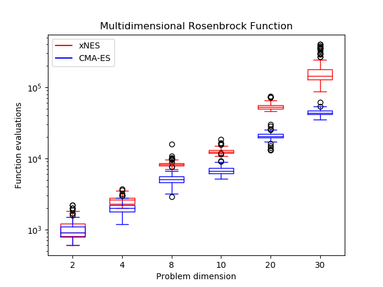
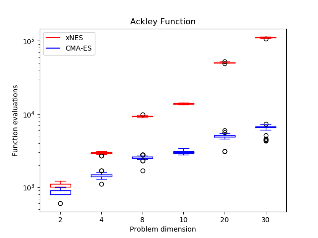
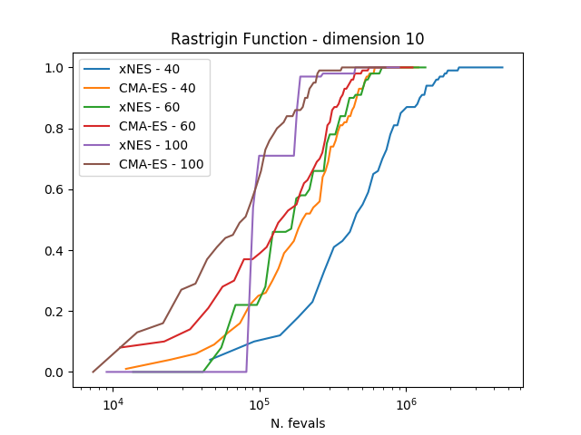
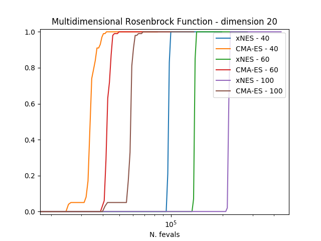
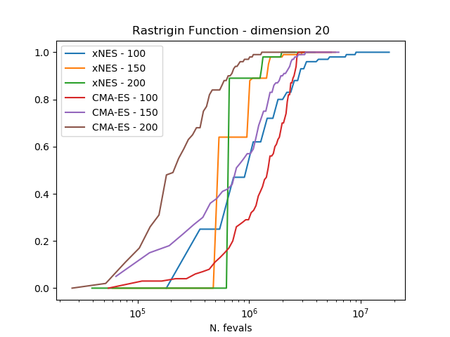

.. _py_tutorial_cmaes_vs_xnes:

Comparing algorithms: the case of xNES and CMA-ES
=================================================

In this tutorial we will show how to use pygmo to comapre the performances of two UDAs. We lay down a standard
procedure which is to be considered the best practice to perfrom comaprisons and should be used when possible, that
is when algorithms have well defined exit conditions.

We take the case of the two UDAs :class:`~pygmo.cmaes` and :class:`~pygmo.xnes`.

Both algorithms are based on the idea of updating a gaussian distribution that regulates the generation
of new samples, but they differ from the update rules, the ones of xNES being arguably more elegant
and surely more compact.

In order to compare the algorithms we use the experimental cumulative distribution function (ECDF) describing
the probability of finding a solution with an objective function smaller than some ``target``
within a certain budget of function evaluations. Estimating such a ECDF can be done using the results from
calling the ``evolve()`` method of the algorithm a number of times (``trials``) and assembling the results in single runs 
containing multiple restarts. 

.. image:: ../../images/cmaes_vs_xnes5.png
   :scale: 50 %

The results clearly show how CMA-ES is, on these three problems considered, outperforming consistently xNES. 

The plots can be obtained by running the script below, where the population size and the udp are properly defined.

.. doctest::

    >>> # 1  We import what is needed
    >>> import pygmo as pg
    >>> import numpy as np
    >>> from matplotlib import pyplot as plt # doctest: +SKIP
    >>> from random import shuffle
    >>> import itertools 
    >>> 
    >>> # 2 - We define the details of the experiment
    >>> trials = 100        # Number of algorithmic runs
    >>> bootstrap = 100     # Number of shuffles of the trials
    >>> target = 1e-6       # value of the objective function to consider success
    >>> n_bins = 100        # Number of bins to divide the ECDF
    >>> udp = pg.rosenbrock # Problem to be solved
    >>> dim = 10            # Problem dimension
    >>>
    >>> # 3 - We instantiate here the problem, algorithms to compare and on what population size
    >>> prob = pg.problem(udp(dim))
    >>> algos = [pg.algorithm(pg.xnes(gen=4000, ftol=1e-8, xtol = 1e-10)), pg.algorithm(pg.cmaes(gen=4000, ftol=1e-8, xtol = 1e-10))]
    >>> popsizes = [10,20,30]
    >>> 
    >>> # For each of the popsizes and algorithms
    >>> for algo, popsize in itertools.product(algos, popsizes): 
    ...     # 4 - We run the algorithms trials times
    ...     run = []
    ...     for i in range(trials):
    ...         pop = pg.population(prob, popsize)
    ...         pop = algo.evolve(pop) # doctest: +SKIP
    ...         run.append([pop.problem.get_fevals(), pop.champion_f[0]])
    ... 
    ...     # 5 - We assemble the restarts in a random order (a run) and compute the number 
    ...     #     of function evaluations needed to reach the target for each run
    ...     target_reached_at = []
    ...     for i in range(bootstrap):
    ...         shuffle(run)
    ...         tmp = [r[1] for r in run]
    ...         t1 = np.array([min(tmp[:(i + 1)]) for i in range(len(tmp))])
    ...         t2 = np.cumsum([r[0] for r in run])
    ...         idx = np.where(t1 < target)
    ...         target_reached_at.append(t2[idx][0])
    ...     target_reached_at = np.array(target_reached_at)
    ... 
    ...     # 6 - We build the ECDF
    ...     fevallim = 2 * max(target_reached_at)
    ...     bins = np.linspace(0, fevallim, n_bins)
    ...     ecdf = []
    ...     for b in bins:
    ...         s = sum((target_reached_at) < b) / len(target_reached_at)
    ...         ecdf.append(s)
    ...     plt.plot(bins, ecdf, label=algo.get_name().split(":")[0] + " - " + str(popsize)) # doctest: +SKIP
    >>> 
    >>> plt.legend()  # doctest: +SKIP
    >>> ax = plt.gca()  # doctest: +SKIP
    >>> ax.set_xscale('log')  # doctest: +SKIP
    >>> plt.title(prob.get_name() + " - dimension " + str(dim))  # doctest: +SKIP
    >>> plt.xlabel("N. fevals")  # doctest: +SKIP

