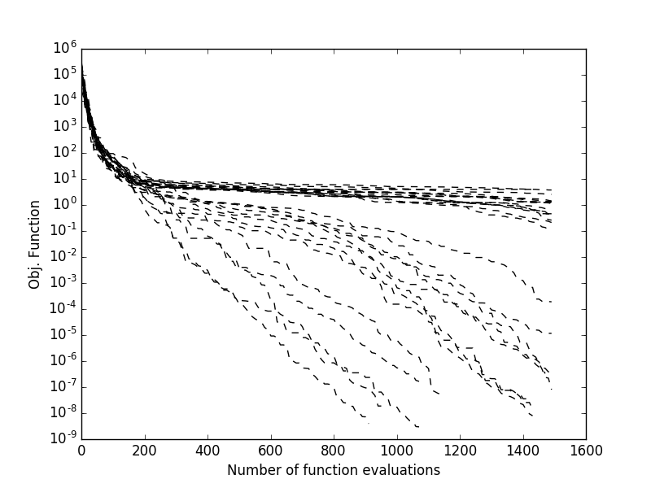
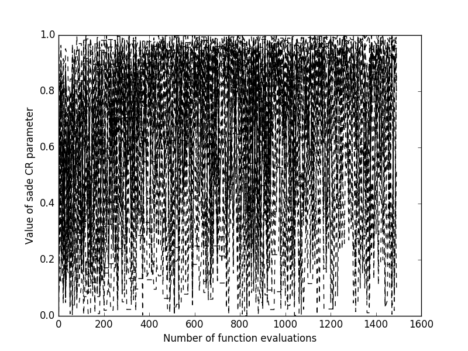

.. _py_tutorial_evolving_population:

Evolving a population
=====================

Solving an optimization problem using an optimization algorithm is, in pygmo,
described as *evolving* a population. In the scientific literature, an interesting
discussion has developed over the past decades on whether evolution is or not a form of
optimization. In pygmo we take the opposite standpoint and we regard optimization,
of all types, as a form of evolution. Regardless on whether you will be using an SQP,
an interior point optimizer or an evolutionary startegy solver, in pygmo you will
always have to call a method called ``evolve()`` to improve over your initial solutions,
i.e. your *population*.

The simplest way to evolve a population is to use directly the :class:`~pygmo.algorithm`
method :func:`~pygmo.algorithm.evolve()`

.. doctest::

    >>> import pygmo as pg
    >>> # The problem
    >>> prob = pg.problem(pg.rosenbrock(dim = 10))
    >>> # The initial population
    >>> pop = pg.population(prob, size = 20)
    >>> # The algorithm (a self-adaptive form of Differential Evolution (sade - jDE variant)
    >>> algo = pg.algorithm(pg.sade(gen = 1000))
    >>> # The actual optimization process
    >>> pop = algo.evolve(pop)
    >>> # Getting the best individual in the population
    >>> best_fitness = pop.get_f()[pop.best_idx()]
    >>> print(best_fitness) # doctest: +SKIP
    [1.31392565e-07]

Clearly, as :class:`~pygmo.sade` is a stochastic optimization algorithm, should we repeat the
evolution starting from the same population, we would obtain different results. If we
want to monitor multiple runs from different initial populations and see how the final best fitness
is achieved as the number of fitness evaluations increase. Most pygmo UDAs allow to do this
as they maintain an internal log that can be accessed after the UDA has been
extracted (see :func:`~pygmo.algorithm.extract()`). This allows, for example to obtain
plots such as those on the right, where multiple trials are monitored:

.. doctest::

    >>> # We set the verbosity to 100 (i.e. each 100 gen there will be a log line)
    >>> algo.set_verbosity(100)
    >>> # We perform an evolution
    >>> pop = pg.population(prob, size = 20)
    >>> pop = algo.evolve(pop) # doctest: +SKIP
        Gen:        Fevals:          Best:             F:            CR:            dx:            df:
           1             20         135745       0.264146       0.541101        61.4904    2.55547e+06
         101           2020        36.7951       0.252116       0.380181        7.01344        179.332
         201           4020        4.06502       0.254534       0.740681        6.00596        59.3928
         301           6020        2.96096       0.147331       0.790883       0.402499        7.95054
         401           8020        2.43639       0.452624       0.922214        5.28217        6.80877
         501          10020        1.65288       0.981585       0.975004        1.34442       0.897989
         601          12020        1.16901        0.97663       0.783304        1.70733        1.36504
         701          14020       0.750577       0.398881       0.922214        2.11136        1.78254
         801          16020       0.438464        0.36723       0.960114        1.65512        1.18982
         901          18020        0.18011        0.25882       0.932028        2.34781         1.4481
        1001          20020      0.0792334       0.412775       0.887402        1.07089       0.211411
        1101          22020     0.00875321       0.852287       0.472265        1.17808       0.170671
        1201          24020    0.000820125       0.529034       0.633499       0.207262      0.0122566
        1301          26020    2.13261e-05       0.176605       0.896106       0.060826    0.000706859
        1401          28020    6.06571e-07       0.105885        0.81249     0.00852982    4.93967e-05
     Exit condition -- generations = 1500
    >>> uda = algo.extract(pg.sade)
    >>> log = uda.get_log()
    >>> import matplotlib.pyplot as plt # doctest: +SKIP
    >>> plt.semilogy([entry[0] for entry in log],[entry[2]for entry in log], 'k--') # doctest: +SKIP
    >>> plt.show() # doctest: +SKIP
