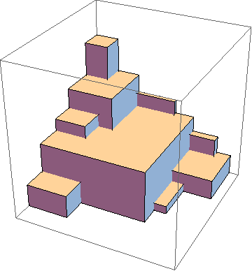
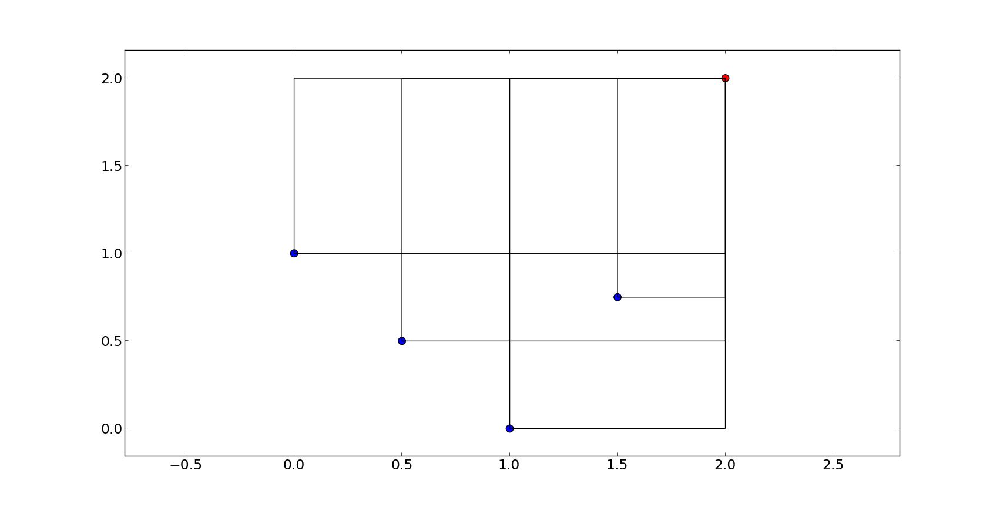

.. _py_tutorial_hypervolume:

=================================
Getting started with hypervolumes
=================================

In multi-objective problems, the notion of solution is that of non-dominated fronts. The
quality of such fronts, i.e. the quality of a solution, can be measured by several indicators.

One of such measures is the hypervolume indicator, which is the hypervolume between a non-dominated front (P) and
a reference point (R). However, to rigorously calcuate the indicator can be time-consuming, hence efficiency
and approximate methods can be very important.

In pygmo the main functionalities allowing to compute the hypervolume indicator (also known as Lebesgue Measure or S-Metric)
and related quantities are provided by the class :class:`~pygmo.hypervolume`. Instantiating this class from a
:class:`~pygmo.population` or simply from a NumPy array will allow to compute the hypervolume indicator or
the exclusive contributions of single points using exact or approximated algorithms.

This tutorial will cover the features introduced by the hypervolume functionality of pygmo.
First, we will describe how the user interface was designed and point out important notions that ought to be taken into account.
Later, we will give several examples in order to get you started with the basic hypervolume computations.

More information on the details
of the algorithms implemented and their performance can be found in the publication:

:Title: "Empirical performance of the approximation of the least hypervolume contributor."
:Authors: Krzysztof Nowak, Marcus Märtens, and Dario Izzo.
:Published in: International Conference on Parallel Problem Solving from Nature. Springer International Publishing, 2014.

Hypervolume interface and construction
======================================
The main class used for the computation of the hypervolume indicator (also known as Lebesgue Measure or S-Metric) and
hypervolume contributions is :class:`pygmo.hypervolume`. You can import the hypervolume class using the following:

.. doctest::

    >>> from pygmo import hypervolume
    >>> 'hypervolume' in dir()
    True

Since the computation of the hypervolume indicator and the hypervolume contributions are bound tightly
to multi-objective optimization, we provide two ways of constructing :class:`~pygmo.hypervolume`.
The first one uses the fitness values of the individuals of a :class:`~pygmo.population` for the input point set:

.. doctest::

    >>> import pygmo as pg
    >>> # Construct a DTLZ-2 problem with 3-dimensional fitness space and 10 dimensions
    >>> udp = pg.problem(pg.dtlz(prob_id = 2, dim = 10, fdim = 3))
    >>> pop = pg.population(udp, 50)
    >>> hv = hypervolume(pop)

.. note::

   You need to reconstruct the :class:`~pygmo.hypervolume` if the fitness values of the population are changing.
   The point set is saved in the :class:`~pygmo.hypervolume` and copied there once upon contruction.

The second way of construction uses an explicit representation of coordinates for the input point set:

.. doctest::

    >>> from numpy import array
    >>> hv = hypervolume(array([[1,0],[0.5,0.5],[0,1]]))
    >>> hv_from_list = hypervolume([[1,0],[0.5,0.5],[0,1]])

This type of construction is especially useful when you have an explicit geometry you want to analyze
rather than implicit coordinates by the fitness values of a population that rely on the objective
function of the corresponding problem.

Computing the hypervolume indicator and hypervolume contributions
=================================================================

Before we give an overview of each hypervolume feature, let us discuss the assumptions we make regarding
the reference point and the input set of points to be valid:

1. We assume **minimization** in every dimension, that is, a reference point is required to be numerically
larger or equal in each objective, and strictly larger in at least one of them.

2. Although the hypervolume for one dimension is well defined mathematically, we require any input data to have
a matching dimension of at least 2, including the reference point.

pygmo helps you with these assumptions as it performs checks upon construction and also before each computation
and will give you an error if your input set or your reference point does not fulfill these criteria.

For simplicity, we will use a simple 2-dimensional front as an example to show the basic features of a hypervolume object:

.. doctest::

  >>> hv = hypervolume([[1, 0], [0.5, 0.5], [0, 1], [1.5, 0.75]] )
  >>> ref_point = [2,2]
  >>> hv.compute(ref_point)
  3.25

We will refer to each point by it's position on the x-axis, e.g. first point is the point (0,1), fourth
point is (1.5, 0.75) etc. The plot below shows you the overall geometry of the example with the reference point painted red.

Once the hypervolume object is created, it allows for the computation of the following figures:

1. :func:`~pygmo.hypervolume.compute()` - Returns the joint hypervolume of the set of points (S-Metric).

.. doctest::

    >>> # hv and ref_point refer to the data above
    >>> hv.compute(ref_point)
    3.25

2. :func:`~pygmo.hypervolume.exclusive()` - Returns the exclusive hypervolume by the point at given index.
   The exclusive hypervolume
   is defined as the part of the space dominated exclusively by one point and is also called its (hypervolume) contribution.

.. doctest::

    >>> # hv and ref_point refer to the data above
    >>> hv.exclusive(1, ref_point)
    0.25
    >>> hv.exclusive(3, ref_point)
    0.0

3. :func:`~pygmo.hypervolume.least_contributor()` - Returns the index of a point contributing the least to the hypervolume.

.. doctest::

    >>> # hv and ref_point refer to the data above
    >>> hv.least_contributor(ref_point) # doctest: +SKIP
    3

4. :func:`~pygmo.hypervolume.greatest_contributor()` - Returns the index of a point contributing the most to the hypervolume.

.. doctest::

    >>> # hv and ref_point refer to the data above
    >>> hv.greatest_contributor(ref_point) # doctest: +SKIP
    0

.. note::
  In case of several least/greatest contributors, pygmo returns only one contributor out of all candidates arbitrarily.

5. :func:`~pygmo.hypervolume.contributions()` - Returns a list of contributions for all points in the set.
   This returns the same results as the successive call to the :func:`~pygmo.hypervolume.exclusive()` method
   for each of the points. Due to the implementation, calling :func:`~pygmo.hypervolume.contributions()` once can
   be much faster (up to a linear factor) than computing all contributions separately
   by using :func:`~pygmo.hypervolume.exclusive()`.

.. doctest::

  >>> # hv and ref_point refer to the data above
  >>> hv.contributions(ref_point) # doctest: +NORMALIZE_WHITESPACE
  array([0.5 , 0.25, 0.5 , 0.  ])

Since all of the methods above require a reference point, it is useful to generate
one automatically using the :func:`~pygmo.nadir()`

This following short script makes use of some of the features mentioned above to show the hypervolume
increase after the evolution of a :class:`~pygmo.population`.

.. doctest::

    >>> import pygmo as pg
    >>> # Instantiates a 4-objectives problem
    >>> prob = pg.problem(pg.dtlz(prob_id=4, dim = 12, fdim=4))
    >>> pop = pg.population(prob, 84)
    >>> # Construct the hypervolume object
    >>> # and get the reference point off-setted by 10 in each objective
    >>> hv = pg.hypervolume(pop)
    >>> offset = 5
    >>> ref_point = hv.refpoint(offset = 0.1)
    >>> hv.compute(ref_point) # doctest: +SKIP
    10.75643
    >>> # Evolve the population some generations
    >>> algo = pg.algorithm(pg.moead(gen=2000))
    >>> pop = algo.evolve(pop)
    >>> # Compute the hypervolume indicator again.
    >>> # This time we expect a higher value as SMS-EMOA evolves the population
    >>> # by trying to maximize the hypervolume indicator.
    >>> hv = pg.hypervolume(pop)
    >>> hv.compute(ref_point) # doctest: +SKIP
    18.73422
