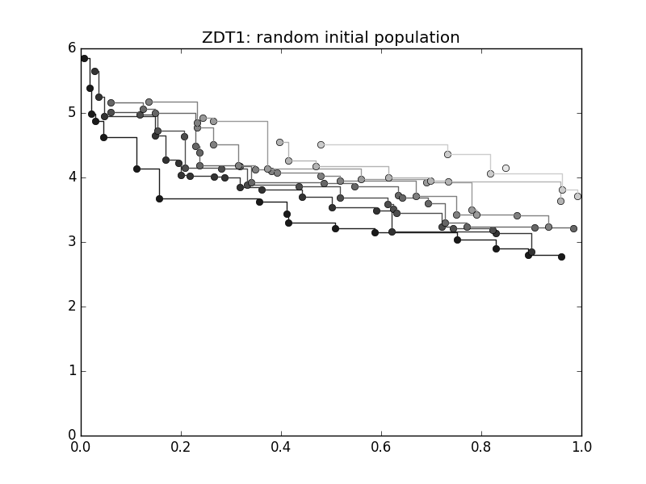
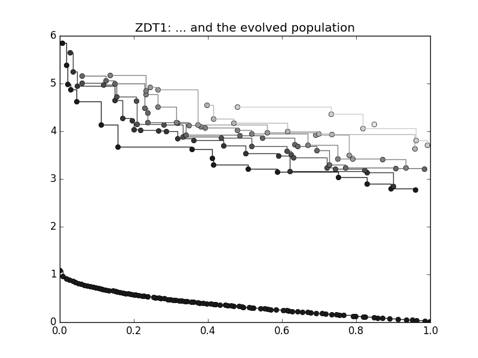

.. _py_tutorial_moo:

================================================================
Basic Multi-Objective Functionalities
================================================================

In this tutorial we will learn how to use pygmo to solve multiple-objective
optimization problems. We assume that you already know how to write your own multi-objective
problem (UDP) and will thus here focus on some added functionalities that are intended to
facilitate the analysis of your problem.

Let us start to define our population:

.. doctest::
   
    >>> from pygmo import *
    >>> udp = zdt(id = 1)
    >>> pop = population(prob = udp, size = 10, seed = 3453412)

We here make use of first problem of the ZDT benchmark suite implemented in :class:`~pygmo.core.zdt` 
and we create a :class:`~pygmo.core.population`
containing 10 individuals randomly created within the box bounds. Which individuals belong to which non-dominated front? 
We can immediately see this by running the fast non-dominated sorting algorithm :func:`~pygmo.core.fast_non_dominated_sorting`

.. doctest::
   
    >>> ndf, dl, dc, ndl = fast_non_dominated_sorting(pop.get_f()) # doctest: +SKIP
    [array([3, 4, 7, 8, 9], dtype=uint64), array([0, 5, 1, 6], dtype=uint64), array([2], dtype=uint64)]

A visualization of the different non-dominated fronts can also be easily obtained. 
For example, generating a new :class:`~pygmo.core.population` with 100 individuals:

.. doctest::
   
    >>> from matplotlib import pyplot as plt # doctest: +SKIP
    >>> pop = population(udp, 100)
    >>> ax = plot_non_dominated_fronts(pop.get_f()) # doctest: +SKIP
    >>> plt.ylim([0,6]) # doctest: +SKIP
    >>> plt.title("ZDT1: random initial population")  # doctest: +SKIP

where each successive pareto front is plotted in darker colour. If we now type:

.. doctest::
   
    >>> algo = algorithm(moead(gen = 250))
    >>> pop = algo.evolve(pop)
    >>> ax = plot_non_dominated_fronts(pop.get_f()) # doctest: +SKIP
    >>> plt.title("ZDT1: ... and the evolved population")  # doctest: +SKIP

we have instantiated the algorithm :class:`~pygmo.core.moead`, able to tackle
multi-objective problems, fixing the number of generations to 250. In the following line we use directly
the method evolve of the algorithm to evolve the :class:`~pygmo.core.population`

The entire population is now on one non-dominated front as can be easily veryfied typing:

.. doctest::
   
    >>> ndf, dl, dc, ndl = fast_non_dominated_sorting(pop.get_f()) 
    >>> print(ndf) # doctest: +SKIP
    [array([ 0,  1,  2,  3,  4,  5,  6,  7,  8,  9, 10, 11, 12, 13, 14, 15, 16,
           17, 18, 19, 20, 21, 22, 23, 24, 25, 26, 27, 28, 29, 30, 31, 32, 33,
           34, 35, 36, 37, 38, 39, 40, 41, 42, 43, 44, 45, 46, 47, 48, 49, 50,
           51, 52, 53, 54, 55, 56, 57, 58, 59, 60, 61, 62, 63, 64, 65, 66, 67,
           68, 69, 70, 71, 72, 73, 74, 75, 76, 77, 78, 79, 80, 81, 82, 83, 84,
           85, 86, 87, 88, 89, 90, 91, 92, 93, 94, 95, 96, 97, 98, 99], dtype=uint64)]

The problem in the :class:`~pygmo.core.zdt` problem suite (as well as those in the :class:`~pygmo.core.dtlz`) have a nice convergence metric
implemented called *p_distance*. We can check how well the non dominated front is covering the known Pareto-front

.. doctest::
   
    >>> udp.p_distance(pop) # doctest: +SKIP
    0.03926512747685471

If we are not happy on the value of such a metric, we can evolve the population for some more generation to 
improve such a figure:

.. doctest::
   
    >>> pop = algo.evolve(pop)
    >>> udp.p_distance(pop) # doctest: +SKIP
    0.010346571321103046