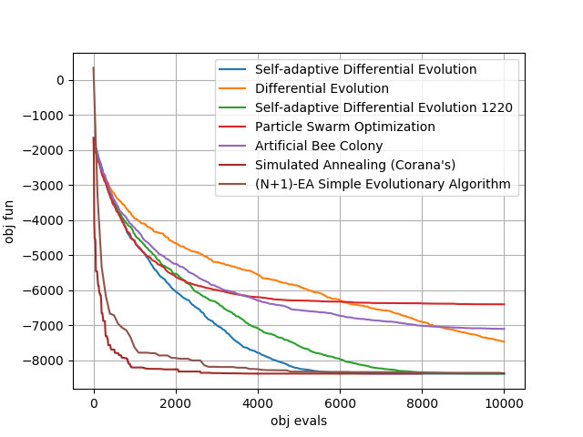
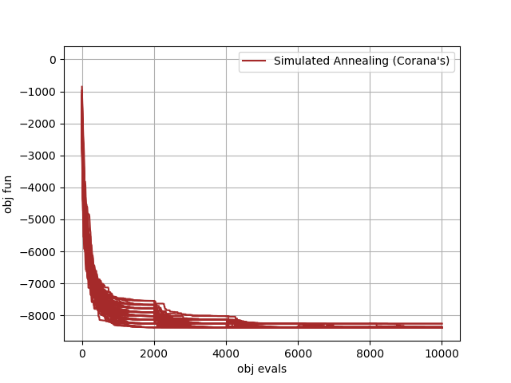

.. _py_tutorial_solving_schwefel:

Solving the 20 dimensional Schwefel problem
===============================================

In this tutorial we will be using many different algorithms to solve the 20 dimensional version
of the Schwefel problem. Such an UDP is coded in the class :class:`~pygmo.schwefel`. The result of the script is the plot 
on the right which is to be produced in a few seconds and that reports the average over 25 runs of some of
the default instances of selected pygmo solvers. The remaining plots shows some single repetitions of the two most successfull algorithms

.. image:: ../../images/sea_schwefel_20.png
   :align: right
   :scale: 60 %

.. doctest::

    >>> import pygmo as pg
    >>> # The user-defined problem
    >>> udp = pg.schwefel(dim = 20)
    >>> # The pygmo problem
    >>> prob = pg.problem(udp)

    >>> # For a number of generation based algorithms we can use a similar script to run and average over 25 runs.
    >>> udas = [pg.sade(gen=500), pg.de(gen=500), pg.de1220(gen=500), pg.pso(gen=500), pg.bee_colony(gen=250, limit=20)]
    >>> for uda in udas:
    ...     logs = []
    ...     for i in range(25):
    ...         algo = pg.algorithm(uda)
    ...         algo.set_verbosity(1) # regulates both screen and log verbosity
    ...         pop = pg.population(prob, 20)
    ...         pop = algo.evolve(pop)
    ...         logs.append(algo.extract(type(uda)).get_log())
    ...     logs = np.array(logs)
    ...     avg_log = np.average(logs,0)
    ...     plt.plot(avg_log[:,1],avg_log[:,2]-418.9829*20 , label=algo.get_name())
    
    >>> # For simulated annealing, since we will be using some reannealing we have to code a different script (and we will
    >>> # also not take any average for brevity)
    >>> logs = []
    >>> algo = pg.algorithm(pg.simulated_annealing(10, 0.01, 5))
    >>> algo.set_verbosity(10)
    >>> pop = pg.population(prob, 20)
    >>> for i in range(5):
    ...     pop = algo.evolve(pop)                                                            
    ...     logs.append(algo.extract(pg.simulated_annealing).get_log())
    >>> for i in range(5):
    ...      plt.plot([l[0]+2000*i for l in logs[i]],[l[1]-418.9829*20 for l in logs[i]],"brown")
    >>> plt.plot([0,0],[1,1],"brown", label=algo.get_name()) # just for the legend

    >>> # For the simple evolutionary startegy we also need ad hoc code
    >>> logs = []
    >>> algo = pg.algorithm(pg.sea(gen = 10000))
    >>> algo.set_verbosity(100)
    >>> pop = pg.population(prob, 1)
    >>> pop = algo.evolve(pop)
    >>> logs = algo.extract(pg.sea).get_log()
    >>> plt.plot([l[1] for l in logs],[l[2]-418.9829*20 for l in logs], label = algo.get_name())

    >>> # We then add details to the plot
    >>> plt.legend()
    >>> plt.yticks([-8000,-7000,-6000,-5000,-4000,-3000,-2000,-1000,0])
    >>> plt.grid()