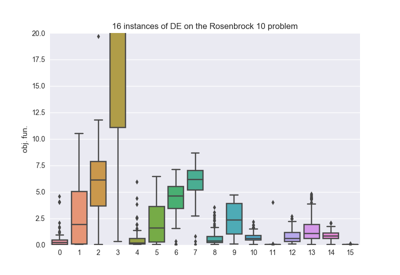

.. _py_tutorial_using_island:

Use of the class :class:`~pygmo.island`
===============================================

.. image:: ../../images/island_no_text.png

The :class:`~pygmo.island` class is the unit parallelization block of pagmo. The idea is that, in pygmo, an :class:`~pygmo.island` is a computational
unit that can be physically located anywhere and that can thus be used to outsource calls to :func:`~pygmo.algorithm.evolve()`
unloading the main computational unit from the task. As such it is able to run evolutions on a separate thread, process or remote machine,
according to the implementation details of the UDI (User Defined Island) whose type it erases. Similarly to how an :class:`~pygmo.algorithm`
evolves a :class:`~pygmo.population` according to the UDA, and a problem computes its fitness according to the UDP.

The non-advanced user does not have to implement his own UDI as we provide the most popular parallel task execution paradigms already
coded in UDIs provided with pygmo, a list of which can be found at :ref:`islands`.

.. note::
   A collection of :class:`pygmo.island` form an :class:`~pygmo.archipelago`, you can skip this tutorial and follow directly the tutorial ":ref:`py_tutorial_using_archipelago`"
   in case you are happy with the default choices pygmo will do for you to parallelize your tasks via the :class:`~pygmo.archipelago`.

We start by instantiating an island.

.. doctest::

    >>> import pygmo as pg
    >>> isl = pg.island(algo = pg.de(10), prob = pg.ackley(5), size=20, udi=pg.thread_island())

Regardless of the *udi* kwarg, should the construction be successfull, a new thread will be opened and delegated
to run the :func:`~pygmo.island.evolve()` method. Since, in this case, we constructed the island specifying an 
*udi*, and in particular we chose the :class:`~pygmo.thread_island`, the population evolution will happen directly
on the opened thread. 

.. note::
   Since an evolution (optimization task) requires both evaluations of the :class:`~pygmo.problem` fitness function and
   the execution of the :class:`~pygmo.algorithm` logic, both these must be marked as thread safe in order for a 
   :class:`~pygmo.thread_island` to be able to run an evolution.

.. doctest::

    >>> isl.evolve()

With this simple command, we run the evolution, and since the task is offloaded to a different thread our current python session or script
is not affected so that we can run other things in the meantime. 

Consider the following script, for example:

    >>> islands = [pg.island(algo = pg.de(gen = 1000, F=effe, CR=cross), prob = pg.rosenbrock(10), size=20, seed=32) for effe in [0.3,0.5,0.7,0.9] for cross in [0.3,0.5,0.7,0.9]]
    >>> _ = [isl.evolve() for isl in islands] #doctest: +SKIP
    >>> _ = [isl.wait() for isl in islands]

In the above three lines of code we run, in parallel threads, the same optimization tasks using 16 Differential Evolution algorithm (:class:`~pygmo.de`) with different values for 
its crossover and *F* parameter. Thanks to the *seed* being specified in the island constructor the same population will be fed to the different algorithmic instances.

.. note::
   Since no *udi* argument is specified, the :class:`~pygmo.island` constructor will choose the island type for us using its own internal heuristics (see the documentation). In this
   case since both the problem and the algorithm are thread safe, a :class:`~pygmo.thread_island` will be chosen (as can be verified calling the ``__repr__()`` method).

.. warning::
   This use of the :class:`~pygmo.island` is, essentially, replicating some of the functionalities of the :class:`~pygmo.archipelago`. While interesting to get acquainted with pygmo
   machinery, and thus great in the context of this tutorial, we discourage this type of scripting and encourage the use of an :class:`~pygmo.archipelago` (with no migration) instead.

Repeating the same computation a hundreds times we can obtain the boxplot on the right, where the best parameters for the algorithm and this task are found. id0: *F* = 0.3, *CR* = 0.3, id11: 
*F* = 0.7, *CR* = 0.9, id15: *F* = 0.9, *CR* = 0.9. The script that generates the plot on the right is reported for convenience.

.. doctest::

    >>> res = []
    >>> for i in range(100):
    ...      islands = [pg.island(algo = pg.de(gen = 1000, F=effe, CR=cross), prob = pg.rosenbrock(10), size=20, seed=32) for effe in [0.3,0.5,0.7,0.9] for cross in [0.3,0.5,0.7,0.9]]
    ...      _ = [isl.evolve() for isl in islands] #doctest: +SKIP
    ...      _ = [isl.wait() for isl in islands]
    ...      res.append([isl.get_population().champion_f[0] for isl in islands])
    >>> import seaborn as sns # doctest: +SKIP
    >>> import pandas as pd # doctest: +SKIP
    >>> import matplotlib.pyplot as plt # doctest: +SKIP
    >>> sns.boxplot(pd.DataFrame(res)) # doctest: +SKIP
    >>> ylim = plt.ylim([0,20]) # doctest: +SKIP
    >>> plt.title("16 instances of DE on the Rosenbrock 10 problem") # doctest: +SKIP
    >>> plt.ylabel("obj. fun.") # doctest: +SKIP

Managing exceptions
^^^^^^^^^^^^^^^^^^^^^^^^^^^^^^^^^^
What happens if, during the optimization task sent to an :class:`~pygmo.island`, an exception happens? The :class:`~pygmo.island` has the
possibility to rethrow the first encountered exception, in the main thread, via a call to its method :func:`~pygmo.island.wait_check()`.
Assume, for example that your problem or algorithm is somehow throwing (I know, what are the chances right?). To illustrate this case, we are going to use the 
following UDP:

.. doctest::

    >>> class raise_exception:
    ...     def __init__(self):
    ...         self.counter=0;
    ...     def fitness(self,dv):
    ...         if self.counter == 300:
    ...             raise ValueError("Ops!")
    ...         self.counter += 1
    ...         return [self.counter]
    ...     def get_bounds(self):
    ...         return ([0],[1])
    ...     def get_name(self):
    ...         return "A throwing UDP"

We construct an island:

    >>> isl = pg.island(algo = pg.de(100), prob = raise_exception(), size=20, udi=pg.ipyparallel_island())

.. note::
   We have explicitly passed the *udi* argument to the island constructor and selected an ipyparallel island.
   This requires that a cluster is started typing, for example, the command ``ipcluster start``.

This construction will trigger :math:`20` function evaluations and thus will not throw. Let us now run an evolution:

    >>> isl.evolve()
    >>> isl.wait()

Everything looks fine: in our thread nothing really happened nor threw. But if we, for example inspect the island we get:

    >>> print(isl) # doctest: +SKIP
    Island name: Ipyparallel island
    	Status: idle - **error occurred**
    <BLANKLINE>
    Extra info:
    	Queue status:
    <BLANKLINE>
    	(unassigned, 0)
    	(0, {'queue': 0, 'completed': ..., 'tasks': 0})
    	(1, {'queue': 0, 'completed': ..., 'tasks': 0})
    	(2, {'queue': 0, 'completed': ..., 'tasks': 0})
    	(3, {'queue': 0, 'completed': ..., 'tasks': 0})
    	(4, {'queue': 0, 'completed': ..., 'tasks': 0})
    	(5, {'queue': 0, 'completed': ..., 'tasks': 0})
    	(6, {'queue': 0, 'completed': ..., 'tasks': 0})
    	(7, {'queue': 0, 'completed': ..., 'tasks': 0})
    <BLANKLINE>
    Algorithm: Differential Evolution
    <BLANKLINE>
    Problem: A throwing UDP
    <BLANKLINE>
    Population size: 20
    	Champion decision vector: ...
    	Champion fitness: ...
    <BLANKLINE>

What has happened? I need to retrieve that message!

    >>> isl.wait_check()
    Traceback (most recent call last):
      File "/Users/darioizzo/miniconda3/envs/pagmo/lib/python3.6/doctest.py", line 1330, in __run
        compileflags, 1), test.globs)
      File "<doctest default[0]>", line 1, in <module>
        isl.wait_check()
    RuntimeError: The asynchronous evolution of a pythonic island of type 'Ipyparallel island' raised an error:
    Traceback (most recent call last):
      File "/Users/darioizzo/.local/lib/python3.6/site-packages/pygmo/_py_islands.py", line 403, in run_evolve
        return ret.get()
      File "/Users/darioizzo/miniconda3/envs/pagmo/lib/python3.6/site-packages/ipyparallel/client/asyncresult.py", line 167, in get
        raise self.exception()
      File "/Users/darioizzo/miniconda3/envs/pagmo/lib/python3.6/site-packages/ipyparallel/client/asyncresult.py", line 224, in _resolve_result
        raise r
    ipyparallel.error.RemoteError: ValueError(Ops!)

