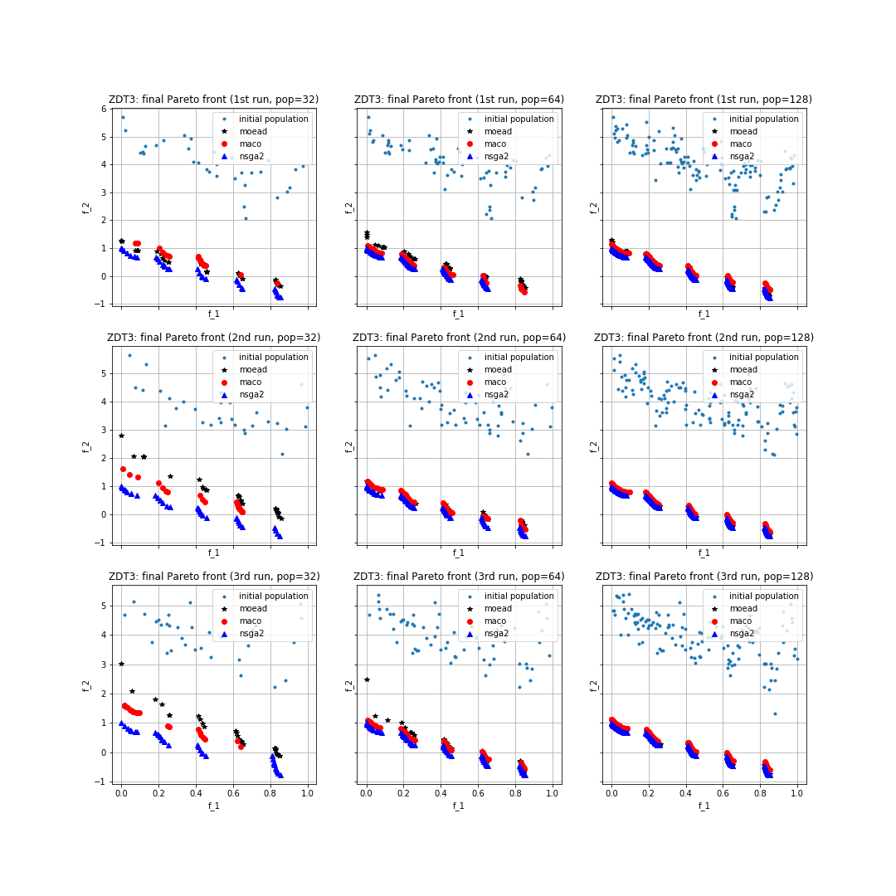

.. _py_tutorial_zdt3_maco_benchmark_comp:

Benchmarking Multi-Objective Ant Colony Optimization on ZDT3 problem
=====================================================================

In this tutorial we will show how to use pygmo to run :class:`~pygmo.maco` algorithm and benchmark it using the 3rd problem of the Zitzler, Deb and Thiele (ZDT) test problem suite which often used for benchmarking multi-objective algorithms on two objective problems.

The ZDT3 problem is a box-constrained continuous bi-objectives problem and is provided as UDP (user-defined problem) by pygmo in the class :class:`~pygmo.zdt`. 
We now want to benchmark three user-defined algorithms. Since this is a multi-objective problem, we need a UDA (user-defined algorithm) which can handle constraints. Hence, we will benchmark the multi-objective ant colony optimization algorithm :class:`~pygmo.maco`, with the multi-objective EA with decomposition (MOEA/D) :class:`~pygmo.moead`, and with the non-dominated sorting GA (NSGA-II) :class:`~pygmo.nsga2`. 

In particular, we will make use of the three aforesaid UDAs with three different population sizes (namely, 32, 64, 128), and running each simulation three times (with a different fixed seed for each time). The Pareto front of this problem is known, and the problems in the :class:`pygmo.zdt` problem suite have a convergence metric implemented called *p_distance* which allows us to check how well the non dominated front is covering the known Pareto-front. Also we will use the concept of :class:`~pygmo.hypervolume` as indicator to compare the final populations of the different algorithms.

In order to run the UDAs on these problems we can write the following piece of code:

.. doctest::
 
    >>> from pygmo import *
    >>> import numpy as np
    >>> from matplotlib import pyplot as plt 
    >>> pop_sizes=[32, 64, 128]
    >>> udp = zdt(prob_id = 3)
    >>> hv_moead=[0, 0, 0]
    >>> hv_maco=[0, 0, 0]
    >>> hv_nsga2=[0, 0, 0]
    >>> p_dist_moead=[0, 0, 0]
    >>> p_dist_maco=[0, 0, 0]
    >>> p_dist_nsga2=[0, 0, 0]
    >>> #We run the algos three times each, for 3 different pop-sizes
    <BLANKLINE>
    >>> for j in pop_sizes:
    ...    for i in range(0,3):
    ...        pop_1 = population(prob = udp, size = j, seed = i)
    ...        pop_2 = population(prob = udp, size = j, seed = i)
    ...        pop_3 = population(prob = udp, size = j, seed = i)
    <BLANKLINE>
    ...        hv=hypervolume(pop_1)
    ...        ref_point=hv.refpoint(offset=0.01)
    <BLANKLINE>
    ...        #I store all the pop-sizes results for all the runs:
    ...        #1st seed:
    ...        if j==pop_sizes[0] and i==0:
    ...            first_pop_32_1=pop_1.get_f()
    <BLANKLINE>
    ...        if j==pop_sizes[1] and i==0:
    ...            first_pop_64_1=pop_1.get_f()
    <BLANKLINE>
    ...        if j==pop_sizes[2] and i==0:
    ...            first_pop_128_1=pop_1.get_f()
    <BLANKLINE>
    ...        #2nd seed:
    ...        if j==pop_sizes[0] and i==1:
    ...            first_pop_32_2=pop_1.get_f()
    <BLANKLINE>
    ...        if j==pop_sizes[1] and i==1:
    ...            first_pop_64_2=pop_1.get_f()
    <BLANKLINE>
    ...        if j==pop_sizes[2] and i==1:
    ...            first_pop_128_2=pop_1.get_f()
    <BLANKLINE>
    ...        #3rd seed:
    ...        if j==pop_sizes[0] and i==2:
    ...            first_pop_32_3=pop_1.get_f()
    <BLANKLINE>
    ...        if j==pop_sizes[1] and i==2:
    ...            first_pop_64_3=pop_1.get_f()
    <BLANKLINE>
    ...        if j==pop_sizes[2] and i==2:
    ...            first_pop_128_3=pop_1.get_f()
    <BLANKLINE>
    ...        algo = algorithm(moead(250, 'random'))
    ...        algo_2 = algorithm(maco(gen = 250, ker = j-20, q = 1.0, threshold = 250, n_gen_mark = 47, evalstop=10000, focus=0.0, memory=False))
    ...        #algo_2 = algorithm(moead(250))
    ...        algo_3 = algorithm(nsga2(gen = 250))
    ...        algo.set_seed(i+1)
    ...        algo_2.set_seed(i+1)
    ...        algo_3.set_seed(i+1)
    ...        pop_1 = algo.evolve(pop_1)
    ...        pop_2=algo_2.evolve(pop_2)
    ...        pop_3 = algo_3.evolve(pop_3)
    <BLANKLINE>
    ...        #This returns a series of arrays: in each of them it is contained (in this order), the -non-dominated front, -domination list, 
    ...        #-domination count, -non-domination rank
    ...        fnds=fast_non_dominated_sorting(pop_1.get_f())
    ...        fnds_2=fast_non_dominated_sorting(pop_2.get_f())
    ...        fnds_3=fast_non_dominated_sorting(pop_3.get_f())
    <BLANKLINE>
    ...        #This returns the first (i.e., best) non-dominated front:
    ...        first_ndf_moead=fnds[0][0]
    ...        first_ndf_maco=fnds_2[0][0]
    ...        first_ndf_nsga2=fnds_3[0][0]
    <BLANKLINE>
    ...        #I store all the pop-sizes non-dominated fronts for all the runs:
    ...        #1st seed:
    ...        if j==pop_sizes[0] and i==0:
    ...            #MOEA/D
    ...            hv_moead[0]=hypervolume(pop_1).compute(ref_point)
    ...            p_dist_moead[0]=udp.p_distance(pop_1)
    ...            first_col_moead_32_1=pop_1.get_f()[first_ndf_moead,0]
    ...            second_col_moead_32_1=pop_1.get_f()[first_ndf_moead,1]
    ...            #MACO
    ...            hv_maco[0]=hypervolume(pop_2).compute(ref_point)
    ...            p_dist_maco[0]=udp.p_distance(pop_2)
    ...           first_col_maco_32_1=pop_2.get_f()[first_ndf_maco,0]
    ...           second_col_maco_32_1=pop_2.get_f()[first_ndf_maco,1]
    ...           #NSGA2
    ...            hv_nsga2[0]=hypervolume(pop_3).compute(ref_point)
    ...            p_dist_nsga2[0]=udp.p_distance(pop_3)
    ...            first_col_nsga2_32_1=pop_3.get_f()[first_ndf_nsga2,0]
    ...            second_col_nsga2_32_1=pop_3.get_f()[first_ndf_nsga2,1]
    <BLANKLINE>
    ...        if j==pop_sizes[1] and i==0:
    ...            #MOEA/D
    ...            hv_moead[1]=hypervolume(pop_1).compute(ref_point)
    ...          p_dist_moead[1]=udp.p_distance(pop_1)
    ...            hv_moead[1]=hypervolume(pop_1).compute(ref_point)
    ...            p_dist_moead[1]=udp.p_distance(pop_1)
    ...            first_col_moead_64_1=pop_1.get_f()[first_ndf_moead,0]
    ...            second_col_moead_64_1=pop_1.get_f()[first_ndf_moead,1]
    ...            #MACO
    ...            hv_maco[1]=hypervolume(pop_2).compute(ref_point)
    ...            p_dist_maco[1]=udp.p_distance(pop_2)
    ...            first_col_maco_64_1=pop_2.get_f()[first_ndf_maco,0]
    ...            second_col_maco_64_1=pop_2.get_f()[first_ndf_maco,1]
    ...            #NSGA2
    ...            hv_nsga2[1]=hypervolume(pop_3).compute(ref_point)
    ...            p_dist_nsga2[1]=udp.p_distance(pop_3)
    ...            first_col_nsga2_64_1=pop_3.get_f()[first_ndf_nsga2,0]
    ...           second_col_nsga2_64_1=pop_3.get_f()[first_ndf_nsga2,1]
    <BLANKLINE>
    ...        if j==pop_sizes[2] and i==0:
    ...            #MOEA/D
    ...           hv_moead[2]=hypervolume(pop_1).compute(ref_point)
    ...            p_dist_moead[2]=udp.p_distance(pop_1)
    ...            first_col_moead_128_1=pop_1.get_f()[first_ndf_moead,0]
    ...            second_col_moead_128_1=pop_1.get_f()[first_ndf_moead,1]
    ...            #MACO
    ...            hv_maco[2]=hypervolume(pop_2).compute(ref_point)
    ...            p_dist_maco[2]=udp.p_distance(pop_2)
    ...            first_col_maco_128_1=pop_2.get_f()[first_ndf_maco,0]
    ...            second_col_maco_128_1=pop_2.get_f()[first_ndf_maco,1]
    ...            #NSGA2
    ...            hv_nsga2[2]=hypervolume(pop_3).compute(ref_point)
    ...            p_dist_nsga2[2]=udp.p_distance(pop_3)
    ...           first_col_nsga2_128_1=pop_3.get_f()[first_ndf_nsga2,0]
    ...           second_col_nsga2_128_1=pop_3.get_f()[first_ndf_nsga2,1]
    <BLANKLINE>
    ...        #2nd seed:
    ...        if j==pop_sizes[0] and i==1:
    ...            #MOEA/D
    ...            hv_moead[0]+=hypervolume(pop_1).compute(ref_point)
    ...            p_dist_moead[0]+=udp.p_distance(pop_1)
    ...            first_col_moead_32_2=pop_1.get_f()[first_ndf_moead,0]
    ...            second_col_moead_32_2=pop_1.get_f()[first_ndf_moead,1]
    ...            #MACO
    ...            hv_maco[0]+=hypervolume(pop_2).compute(ref_point)
    ...            p_dist_maco[0]+=udp.p_distance(pop_2)
    ...            first_col_maco_32_2=pop_2.get_f()[first_ndf_maco,0]
    ...            second_col_maco_32_2=pop_2.get_f()[first_ndf_maco,1]
    ...            #NSGA2
    ...            hv_nsga2[0]+=hypervolume(pop_3).compute(ref_point)
    ...           p_dist_nsga2[0]+=udp.p_distance(pop_3)
    ...            first_col_nsga2_32_2=pop_3.get_f()[first_ndf_nsga2,0]
    ...            second_col_nsga2_32_2=pop_3.get_f()[first_ndf_nsga2,1]
    <BLANKLINE>
    ...        if j==pop_sizes[1] and i==1:
    ...            #MOEA/D
    ...            hv_moead[1]+=hypervolume(pop_1).compute(ref_point)
    ...            p_dist_moead[1]+=udp.p_distance(pop_1)
    ...            first_col_moead_64_2=pop_1.get_f()[first_ndf_moead,0]
    ...            second_col_moead_64_2=pop_1.get_f()[first_ndf_moead,1]
    ...            #MACO
    ...            hv_maco[1]+=hypervolume(pop_2).compute(ref_point)
    ...            p_dist_maco[1]+=udp.p_distance(pop_2)
    ...            first_col_maco_64_2=pop_2.get_f()[first_ndf_maco,0]
    ...            second_col_maco_64_2=pop_2.get_f()[first_ndf_maco,1]
    ...            #NSGA2
    ...            hv_nsga2[1]+=hypervolume(pop_3).compute(ref_point)
    ...            p_dist_nsga2[1]+=udp.p_distance(pop_3)
    ...            first_col_nsga2_64_2=pop_3.get_f()[first_ndf_nsga2,0]
    ...            second_col_nsga2_64_2=pop_3.get_f()[first_ndf_nsga2,1]
    <BLANKLINE>
    ...        if j==pop_sizes[2] and i==1:
    ...            #MOEA/D
    ...            hv_moead[2]+=hypervolume(pop_1).compute(ref_point)
    ...            p_dist_moead[2]+=udp.p_distance(pop_1)
    ...            first_col_moead_128_2=pop_1.get_f()[first_ndf_moead,0]
    ...            second_col_moead_128_2=pop_1.get_f()[first_ndf_moead,1]
    ...            #MACO
    ...            hv_maco[2]+=hypervolume(pop_2).compute(ref_point)
    ...            p_dist_maco[2]+=udp.p_distance(pop_2)
    ...           first_col_maco_128_2=pop_2.get_f()[first_ndf_maco,0]
    ...            second_col_maco_128_2=pop_2.get_f()[first_ndf_maco,1]
    ...           #NSGA2
    ...            hv_nsga2[2]+=hypervolume(pop_3).compute(ref_point)
    ...            p_dist_nsga2[2]+=udp.p_distance(pop_3)
    ...            first_col_nsga2_128_2=pop_3.get_f()[first_ndf_nsga2,0]
    ...            second_col_nsga2_128_2=pop_3.get_f()[first_ndf_nsga2,1]
    <BLANKLINE>
    ...        #3rd seed:
    ...        if j==pop_sizes[0] and i==2:
    ...            #MOEA/D
    ...            hv_moead[0]+=hypervolume(pop_1).compute(ref_point)
    ...            p_dist_moead[0]+=udp.p_distance(pop_1)
    ...            first_col_moead_32_3=pop_1.get_f()[first_ndf_moead,0]
    ...            second_col_moead_32_3=pop_1.get_f()[first_ndf_moead,1]
    ...            #MACO
    ...            hv_maco[0]+=hypervolume(pop_2).compute(ref_point)
    ...            p_dist_maco[0]+=udp.p_distance(pop_2)
    ...            first_col_maco_32_3=pop_2.get_f()[first_ndf_maco,0]
    ...            second_col_maco_32_3=pop_2.get_f()[first_ndf_maco,1]
    ...            #NSGA2
    ...            hv_nsga2[0]+=hypervolume(pop_3).compute(ref_point)
    ...           p_dist_nsga2[0]+=udp.p_distance(pop_3)
    ...            first_col_nsga2_32_3=pop_3.get_f()[first_ndf_nsga2,0]
    ...            second_col_nsga2_32_3=pop_3.get_f()[first_ndf_nsga2,1]
    <BLANKLINE>
    ...        if j==pop_sizes[1] and i==2:
    ...            #MOEA/D
    ...            hv_moead[1]+=hypervolume(pop_1).compute(ref_point)
    ...            p_dist_moead[1]+=udp.p_distance(pop_1)
    ...            first_col_moead_64_3=pop_1.get_f()[first_ndf_moead,0]
    ...            second_col_moead_64_3=pop_1.get_f()[first_ndf_moead,1]
    ...            #MACO
    ...            hv_maco[1]+=hypervolume(pop_2).compute(ref_point)
    ...            p_dist_maco[1]+=udp.p_distance(pop_2)
    ...            first_col_maco_64_3=pop_2.get_f()[first_ndf_maco,0]
    ...            second_col_maco_64_3=pop_2.get_f()[first_ndf_maco,1]
    ...            #NSGA2
    ...            hv_nsga2[1]+=hypervolume(pop_3).compute(ref_point)
    ...           p_dist_nsga2[1]+=udp.p_distance(pop_3)
    ...            first_col_nsga2_64_3=pop_3.get_f()[first_ndf_nsga2,0]
    ...            second_col_nsga2_64_3=pop_3.get_f()[first_ndf_nsga2,1]
    <BLANKLINE>

    ...        if j==pop_sizes[2] and i==2:
    ...            #MOEA/D
    ...            hv_moead[2]+=hypervolume(pop_1).compute(ref_point)
    ...            p_dist_moead[2]+=udp.p_distance(pop_1)
    ...            first_col_moead_128_3=pop_1.get_f()[first_ndf_moead,0]
    ...            second_col_moead_128_3=pop_1.get_f()[first_ndf_moead,1]
    ...            #MACO
    ...            hv_maco[2]+=hypervolume(pop_2).compute(ref_point)
    ...            p_dist_maco[2]+=udp.p_distance(pop_2)
    ...            first_col_maco_128_3=pop_2.get_f()[first_ndf_maco,0]
    ...            second_col_maco_128_3=pop_2.get_f()[first_ndf_maco,1]
    ...            #NSGA2
    ...            hv_nsga2[2]+=hypervolume(pop_3).compute(ref_point)
    ...            p_dist_nsga2[2]+=udp.p_distance(pop_3)
    ...            first_col_nsga2_128_3=pop_3.get_f()[first_ndf_nsga2,0]
    ...            second_col_nsga2_128_3=pop_3.get_f()[first_ndf_nsga2,1]

As we can observe from the python script, we are running the three algorithms for 250 generations using the three different population sizes (32, 64, 128) and storing the final non-dominated Pareto front together with the hypervolume and p-distance values of the final populations.
We can now plot the results in the fitness space (i.e., by plotting in the y-axis the second fitness value and in the x-axis the first fitness value). Also, we will print the average over the three runs of the hypervolume and p-distance values for the three algorithms and for all the population sizes. In particular, the first element of the vector corresponds to the average over the three runs of the population size 32, whereas the second of the population size 64, and the third of 128. For doing this, we write the following piece of code:

.. doctest::
    
    >>> import matplotlib as mlp #doctest: +SKIP

    >>> print('\n joint hypervolume MOEA/D :\n') #doctest: +SKIP
    >>> print(np.array(hv_moead)/3) #doctest: +SKIP
    >>> print('\n joint hypervolume MACO: \n') #doctest: +SKIP
    >>> print(np.array(hv_maco)/3) #doctest: +SKIP
    >>> print('\n joint hypervolume NSGA2: \n') #doctest: +SKIP
    >>> print(np.array(hv_nsga2)/3) #doctest: +SKIP
    >>> print('\n p-distance MOEA/D: \n') #doctest: +SKIP
    >>> print(np.array(p_dist_moead)/3) #doctest: +SKIP
    >>> print('\n p-distance MACO: \n') #doctest: +SKIP
    >>> print(np.array(p_dist_maco)/3) #doctest: +SKIP
    >>> print('\n p-distance NSGA-II: \n') #doctest: +SKIP
    >>> print(np.array(p_dist_nsga2)/3) #doctest: +SKIP
     joint hypervolume MOEA/D: #doctest: +SKIP
    [4.68242751 5.2765971  5.57259658] #doctest: +SKIP

     joint hypervolume MACO: #doctest: +SKIP
    [4.74695083 5.38002359 5.49987744] #doctest: +SKIP

     joint hypervolume NSGA2: #doctest: +SKIP
    [5.45305456 5.58634807 5.65456127] #doctest: +SKIP

     p-distance MOEA/D: #doctest: +SKIP
    [0.98580786 0.43830665 0.11202489] #doctest: +SKIP

     p-distance MACO: #doctest: +SKIP
    [0.75737982 0.27526069 0.21809924] #doctest: +SKIP

     p-distance NSGA-II: #doctest: +SKIP
    [0.01847673 0.00465985 0.00137918] #doctest: +SKIP

    >>> fig, axes = plt.subplots(nrows=3, ncols=3, sharex='col', sharey='row', figsize=(15,15)) #doctest: +SKIP

    >>> axes[0,0].plot(first_pop_32_1[:,0], first_pop_32_1[:,1], '.', label= 'initial population') #doctest: +SKIP
    >>> axes[0,0].plot(first_col_moead_32_1, second_col_moead_32_1,'k*', label = 'moead') #doctest: +SKIP
    >>> axes[0,0].plot(first_col_maco_32_1, second_col_maco_32_1,'ro', label = 'maco') #doctest: +SKIP
    >>> axes[0,0].plot(first_col_nsga2_32_1, second_col_nsga2_32_1, 'b^', label = 'nsga2') #doctest: +SKIP
    >>> axes[0,0].legend(loc='upper right') #doctest: +SKIP
    >>> axes[0,0].set_title('ZDT3: final Pareto front (1st run, pop=32)') #doctest: +SKIP

    >>> axes[0,1].plot(first_pop_64_1[:,0], first_pop_64_1[:,1], '.', label= 'initial population') #doctest: +SKIP
    >>> axes[0,1].plot(first_col_moead_64_1, second_col_moead_64_1,'k*', label = 'moead') #doctest: +SKIP
    >>> axes[0,1].plot(first_col_maco_64_1, second_col_maco_64_1,'ro', label = 'maco') #doctest: +SKIP
    >>> axes[0,1].plot(first_col_nsga2_64_1, second_col_nsga2_64_1, 'b^', label = 'nsga2') #doctest: +SKIP
    >>> axes[0,1].legend(loc='upper right') #doctest: +SKIP
    >>> axes[0,1].set_title('ZDT3: final Pareto front (1st run, pop=64)') #doctest: +SKIP

    >>> axes[0,2].plot(first_pop_128_1[:,0], first_pop_128_1[:,1], '.', label= 'initial population') #doctest: +SKIP
    >>> axes[0,2].plot(first_col_moead_128_1, second_col_moead_128_1,'k*', label = 'moead') #doctest: +SKIP
    >>> axes[0,2].plot(first_col_maco_128_1, second_col_maco_128_1,'ro', label = 'maco') #doctest: +SKIP
    >>> axes[0,2].plot(first_col_nsga2_128_1, second_col_nsga2_128_1, 'b^', label = 'nsga2') #doctest: +SKIP
    >>> axes[0,2].legend(loc='upper right') #doctest: +SKIP
    >>> axes[0,2].set_title('ZDT3: final Pareto front (1st run, pop=128)') #doctest: +SKIP

    >>> axes[1,0].plot(first_pop_32_2[:,0], first_pop_32_2[:,1], '.', label= 'initial population') #doctest: +SKIP
    >>> axes[1,0].plot(first_col_moead_32_2, second_col_moead_32_2,'k*', label = 'moead') #doctest: +SKIP
    >>> axes[1,0].plot(first_col_maco_32_2, second_col_maco_32_2,'ro', label = 'maco') #doctest: +SKIP
    >>> axes[1,0].plot(first_col_nsga2_32_2, second_col_nsga2_32_2, 'b^', label = 'nsga2') #doctest: +SKIP
    >>> axes[1,0].legend(loc='upper right') #doctest: +SKIP
    >>> axes[1,0].set_title('ZDT3: final Pareto front (2nd run, pop=32)') #doctest: +SKIP

    >>> axes[1,1].plot(first_pop_64_2[:,0], first_pop_64_2[:,1], '.', label= 'initial population') #doctest: +SKIP
    >>> axes[1,1].plot(first_col_moead_64_2, second_col_moead_64_2,'k*', label = 'moead') #doctest: +SKIP
    >>> axes[1,1].plot(first_col_maco_64_2, second_col_maco_64_2,'ro', label = 'maco') #doctest: +SKIP
    >>> axes[1,1].plot(first_col_nsga2_64_2, second_col_nsga2_64_2, 'b^', label = 'nsga2') #doctest: +SKIP
    >>> axes[1,1].legend(loc='upper right') #doctest: +SKIP
    >>> axes[1,1].set_title('ZDT3: final Pareto front (2nd run, pop=64)') #doctest: +SKIP

    >>> axes[1,2].plot(first_pop_128_2[:,0], first_pop_128_2[:,1], '.', label= 'initial population') #doctest: +SKIP
    >>> axes[1,2].plot(first_col_moead_128_2, second_col_moead_128_2,'k*', label = 'moead') #doctest: +SKIP
    >>> axes[1,2].plot(first_col_maco_128_2, second_col_maco_128_2,'ro', label = 'maco') #doctest: +SKIP
    >>> axes[1,2].plot(first_col_nsga2_128_2, second_col_nsga2_128_2, 'b^', label = 'nsga2') #doctest: +SKIP
    >>> axes[1,2].legend(loc='upper right') #doctest: +SKIP
    >>> axes[1,2].set_title('ZDT3: final Pareto front (2nd run, pop=128)') #doctest: +SKIP

    >>> axes[2,0].plot(first_pop_32_3[:,0], first_pop_32_3[:,1], '.', label= 'initial population') #doctest: +SKIP
    >>> axes[2,0].plot(first_col_moead_32_3, second_col_moead_32_3,'k*', label = 'moead') #doctest: +SKIP
    >>> axes[2,0].plot(first_col_maco_32_3, second_col_maco_32_3,'ro', label = 'maco') #doctest: +SKIP
    >>> axes[2,0].plot(first_col_nsga2_32_3, second_col_nsga2_32_3, 'b^', label = 'nsga2') #doctest: +SKIP
    >>> axes[2,0].legend(loc='upper right') #doctest: +SKIP
    >>> axes[2,0].set_title('ZDT3: final Pareto front (3rd run, pop=32)') #doctest: +SKIP

    >>> axes[2,1].plot(first_pop_64_3[:,0], first_pop_64_3[:,1], '.', label= 'initial population') #doctest: +SKIP
    >>> axes[2,1].plot(first_col_moead_64_3, second_col_moead_64_3,'k*', label = 'moead') #doctest: +SKIP
    >>> axes[2,1].plot(first_col_maco_64_3, second_col_maco_64_3,'ro', label = 'maco') #doctest: +SKIP
    >>> axes[2,1].plot(first_col_nsga2_64_3, second_col_nsga2_64_3, 'b^', label = 'nsga2') #doctest: +SKIP
    >>> axes[2,1].legend(loc='upper right') #doctest: +SKIP
    >>> axes[2,1].set_title('ZDT3: final Pareto front (3rd run, pop=64)') #doctest: +SKIP

    >>> axes[2,2].plot(first_pop_128_3[:,0], first_pop_128_3[:,1], '.', label= 'initial population') #doctest: +SKIP
    >>> axes[2,2].plot(first_col_moead_128_3, second_col_moead_128_3,'k*', label = 'moead') #doctest: +SKIP
    >>> axes[2,2].plot(first_col_maco_128_3, second_col_maco_128_3,'ro', label = 'maco') #doctest: +SKIP
    >>> axes[2,2].plot(first_col_nsga2_128_3, second_col_nsga2_128_3, 'b^', label = 'nsga2') #doctest: +SKIP
    >>> axes[2,2].legend(loc='upper right') 
    >>> axes[2,2].set_title('ZDT3: final Pareto front (3rd run, pop=128)') #doctest: +SKIP

    >>> for ax in axes.flat: #doctest: +SKIP
    ...    ax.set(xlabel='f_1', ylabel='f_2') #doctest: +SKIP
    ...    ax.grid() #doctest: +SKIP

The resulting plot can be seen in the following figure:

